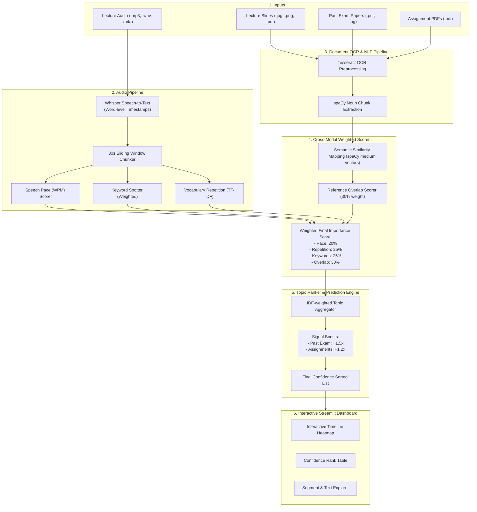

# 👻 Lecture Ghost

**Lecture Ghost** is a cutting-edge, multimodal AI-powered study assistant that analyzes and predicts which topics from your lectures are most likely to appear on your upcoming exams.

By simultaneously analyzing **lecture audio recordings**, **slides/handouts**, **past exam papers**, and **assignment PDFs**, Lecture Ghost extracts, matches, and scores core concepts using a sophisticated cross-modal weighted importance scorer. It then delivers an interactive Streamlit dashboard featuring a visual heatmap timeline, a prioritized topic table with confidence scores, and a segment explorer.

---

## 🚀 Key Features

* **Multimodal Data Fusion**: Analyzes lecture audio (via Whisper), presentation slides (via OCR), assignments (via PDF parsing), and past exam papers to establish a comprehensive knowledge web.
* **Intelligent Audio Analytics**: Automatically chunks raw audio into sliding-window segments, detecting emphasis through:
  * **Speech Pace (WPM)**: Identifies when a professor slows down to explain difficult or important topics.
  * **Keyword Spotting**: Searches for weighted exam-signal verbal cues (e.g., *"this is crucial"*, *"will be on the exam"*).
  * **Vocabulary Repetition**: Tracks recurring terms between adjacent segments to measure topic reinforcement.
* **Semantic Cross-Modal Overlap**: Utilizes advanced Natural Language Processing (via **spaCy** word vectors) to calculate semantic similarity and map lecture topics to past exams and assignments.
* **Interactive Streamlit UI**: Offers:
  * **Visual Heatmap Timeline**: Highlighted high-importance time blocks.
  * **Prioritized Exam Prediction Table**: Top predicted topics ranked by confidence.
  * **Interactive Segment Explorer**: Listen to or read high-priority segments.
  * **JSON Reports**: Export structured results for external use.
* **Self-Contained Integration Test Suite**: Includes a complete mock pipeline simulation to verify system integrity instantly.

---

## 🛠️ Architecture & Data Flow

Below is the workflow of how Lecture Ghost transforms raw, multimodal materials into prioritized exam predictions:



---

## ⚡ How It Works (Scoring Model)

Lecture Ghost operates using a configurable, scientifically-backed scoring model to weight features:

### 1. Cross-Modal Scoring Weights (Configurable in `config.py`)
Each 30-second sliding-window segment is analyzed against four core metrics:
* **Speech Pace Score (`pace_score` - 20% weight)**: Calculates words-per-minute (WPM). Slower WPM scores higher as it reflects natural emphasis.
* **Repetition Score (`repetition_score` - 25% weight)**: Measures the TF-IDF vocabulary similarity between adjacent segments to detect persistent teaching.
* **Keyword Score (`keyword_score` - 25% weight)**: Spotlights specific exam-relevant verbal cues. Examples:
  * *High Weight (1.0)*: `"this will be on the exam"`, `"expected in exam"`, `"this appears every year"`, `"classic question"`, `"this is crucial"`
  * *Medium Weight (0.7)*: `"important"`, `"key concept"`, `"focus on this"`, `"most likely"`
  * *Low Weight (0.4)*: `"remember this"`, `"recall"`, `"pay attention"`, `"don't forget"`
* **Overlap Score (`overlap_score` - 30% weight)**: Calculates the maximum semantic similarity (spaCy vector cosine similarity threshold **0.65**) between lecture terms and extracted document terms.

### 2. Topic Signal Boosts
When ranking global topics, Lecture Ghost aggregates segment-level scores and applies multiplier boosts based on where else the terms appeared:
* **Past Exam Paper Boost**: **+1.5x** multiplier (if a topic has appeared on a past exam, it is highly likely to reappear).
* **Assignment Boost**: **+1.2x** multiplier (topics active in recent assignments show immediate syllabus priority).

---

## 📁 Directory Structure

```
lacture ghost/
├── README.md               # Master documentation (this file)
├── .gitignore              # Git ignore file (excludes virtual environments, cache, JSON outputs)
└── lecture_ghost/
    ├── main.py            # Streamlit Web UI and Dashboard entry point
    ├── audio_pipeline.py  # Transcription processing & audio-signal extraction
    ├── ocr_pipeline.py    # Document processing, Tesseract OCR, & spaCy NLP topic extraction
    ├── scorer.py          # Cross-modal weighted scoring logic and threshold classification
    ├── topic_ranker.py    # Aggregates, boosts, and ranks final exam topic predictions
    ├── config.py          # Centralized configuration (weights, thresholds, keyword dicts, models)
    ├── utils.py           # Core utilities (text cleaning, bigrams, JSON file I/O, chunking)
    ├── test_runner.py     # End-to-end integration and system self-testing script
    └── requirements.txt   # Declared Python dependencies
```

---

## 🛠️ Installation & Setup

### Prerequisites
* **Python 3.10+**
* **Tesseract OCR** binary installed on your OS
* **Poppler** (required by `pdf2image` to convert PDFs to OCR-ready images)

#### Install System Binaries

* **macOS (via Homebrew)**:
  ```bash
  brew install tesseract poppler
  ```
* **Windows**:
  1. Download and run the Tesseract installer from [UB-Mannheim's Tesseract Wiki](https://github.com/UB-Mannheim/tesseract/wiki). Add the installation path (typically `C:\Program Files\Tesseract-OCR`) to your system `PATH`.
  2. Download Poppler for Windows from [oschwartz10612's Releases](https://github.com/oschwartz10612/poppler-windows/releases) and add its `bin/` directory to your system `PATH`.
* **Linux (Ubuntu/Debian)**:
  ```bash
  sudo apt-get update
  sudo apt-get install tesseract-ocr poppler-utils
  ```

---

### Setup Workspace & Python Environment

```bash
# 1. Clone the project and navigate into the source directory
cd "lacture ghost/lecture_ghost"

# 2. Create a virtual environment
python3 -m venv .venv

# 3. Activate the virtual environment
# On macOS/Linux:
source .venv/bin/activate
# On Windows:
.venv\Scripts\activate

# 4. Install all Python dependencies
pip install -r requirements.txt

# 5. Download the required spaCy English Medium model (essential for word vector semantic similarity)
python3 -m spacy download en_core_web_md
```

---

## 🏃 Running the Application

Once your virtual environment is active and libraries are installed, start the web interface:

```bash
streamlit run main.py
```

The application will launch in your default web browser at `http://localhost:8501`.

### How to Predict Topics in 6 Steps:
1. **Upload Lecture Audio**: Select your `.mp3`, `.wav`, or `.m4a` file in the sidebar (only required input).
2. **Upload Reference Docs (Optional but Recommended)**: Drag and drop slides, assignments, or past exam papers.
3. **Run Analysis**: Click **Analyze** and monitor progress as the Whisper transcribe, OCR, chunk-scoring, and ranking pipelines execute sequentially.
4. **Heatmap & Timeline**: Explore which segments of the lecture contain the highest intensity of exam signals.
5. **Topic Forecast**: Check the ranked table of topics with confidence ratings, and see whether they appeared in assignments/exams.
6. **Download Report**: Save the output as a clean `.json` file for future study sessions.

---

## 🧪 Running the Test Suite

Lecture Ghost comes with an extensive, zero-dependency mock integration test runner (`test_runner.py`). It simulates a full 10-minute Machine Learning lecture, executing speech-pace, keyword, repetition, OCR, scoring, and ranking pipelines to verify system mathematical alignment without calling external network/GPU processes.

To execute the test suite:

```bash
python3 test_runner.py
```

A successful output will look like this:
```
============================================================
  👻  LECTURE GHOST — SELF-TEST SUITE
============================================================

------------------------------------------------------------
  SECTION 1 — utils.py
------------------------------------------------------------
  ✅  clean_text removes punctuation & fillers
  ✅  normalize_score mid-range
  ...
  ✅  All checks passed — Lecture Ghost is working correctly!
```

---

## ⚠️ Known Limitations & Customizations

* **Transcription Speed**: By default, Lecture Ghost uses the Whisper `"base"` model. If you are experiencing accents or need higher accuracy, you can edit `config.py` and set `WHISPER_MODEL = "small"` or `"medium"`.
* **OCR Resolution**: Low-contrast scans or handwritten notes may impact OCR quality. For best results, use scans of 300+ DPI.
* **Audio-only Mode**: If you run an analysis without past papers or assignments, the `overlap_score` will simply default to `0.0` for all chunks, but topic ranking will still operate fully based on audio indicators!
